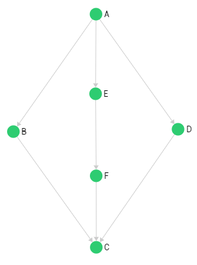

Multiple Path Search
====================
The shortest path algorithm can only determine one shortest path.
For example, if this is the full graph:



...then a shortest path query from **A** to **C** may return the path `A -> B -> C` or `A -> D -> C`, but it's undefined which one (not taking edge weights into account here).

You can use the efficient shortest path algorithm however, to determine the shortest path length:
```
RETURN LENGTH(
  FOR v IN OUTBOUND
    SHORTEST_PATH "verts/A" TO "verts/C" edges
    RETURN v
)
```

The result is 3 for the example graph (includes the start vertex). Now, subtract 1 to get the edge count / traversal depth. You can run a pattern matching traversal to find all paths with this length (or longer ones by increasing the min and max depth). Starting point is **A** again, and a filter on the document ID of v (or p.vertices[-1]) ensures that we only retrieve paths that end at point **C**.

The following query returns all parts with length 2, start vertex **A** and target vertex **C**:
```
FOR v, e, p IN 2..2 OUTBOUND "verts/A" edges
  FILTER v._id == "verts/C"
  RETURN CONCAT_SEPARATOR(" -> ", p.vertices[*]._key)
```
Output: 
```
[
  "A -> B -> C",
  "A -> D -> C"
]
```

A traversal depth of `3..3` would return `A -> E -> F -> C` and `2..3` all three paths.

Note that two separate queries are required to compute the shortest path length and to do the pattern matching based on the shortest path length (minus 1), because min and max depth can't be expressions (they have to be known in advance, so either be number literals or bind parameters).
